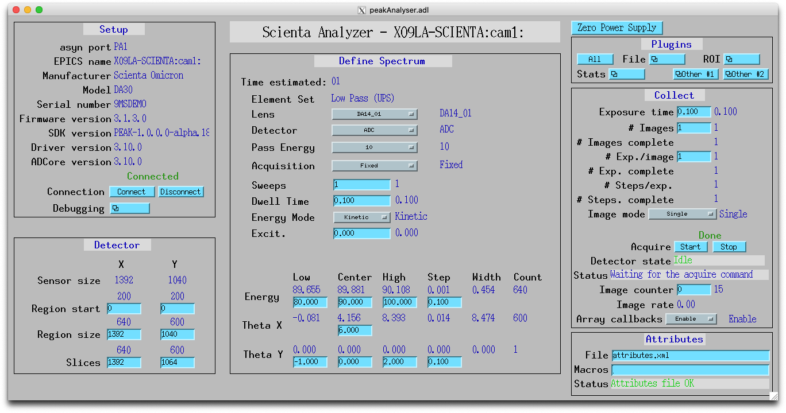

peakAnalyser
============

:author: Xiaoqiang Wang

.. _EPICS: https://epics-controls.org
.. _areaDetector: https://areadetector.github.io/master/index.html
.. _Scienta Omicron: https://scientaomicron.com
.. _PEAK: https://scientaomicron.com/en/Instruments/Electron-Analysers/PEAK
.. _ADDriver: https://areadetector.github.io/master/ADCore/ADDriver.html
.. _websocketpp: https://github.com/zaphoyd/websocketpp
.. _asio: https://github.com/chriskohlhoff/asio
.. _restApi: https://github.com/areaDetector/ADEiger/tree/master/eigerApp/src     

.. contents:: Contents

Introduction
------------

This is an `EPICS`_ `areaDetector`_ driver for `Scienta Omicron`_ analysers using the `PEAK`_ API.
It has been tested with PEAK software release 1.3.0 with a DA30L analyser.
Due to the many changes in PEAK API, the minimum required PEAK version is 1.3.0.

The PEAK API uses JSON-RPC protocol and supports both HTTP and WebSocket. This driver will choose
the implementation based on the host address, i.e. *ws://127.0.0.1:8087* for WebSocket and *http://127.0.0.1:8087*
for HTTP.

Implementation of standard driver parameters
--------------------------------------------

The following table describes how the driver implements some of
the standard driver parameters defined in `ADDriver`_.

.. cssclass:: table-bordered table-striped table-hover
.. flat-table::
  :header-rows: 1
  :widths: 20 10 70

  * - EPICS record name
    - EPICS record type
    - Description
  * - $(P)$(R)AcquireTime, $(P)$(R)AcquireTime_RBV
    - ao, ai
    - Analyser dwell time.
  * - $(P)$(R)NumImages, $(P)$(R)NumImages_RBV
    - longout, longin
    - Number of spectra to acquire in *Multiple* image mode.
  * - $(P)$(R)NumExposures, $(P)$(R)NumExposures_RBV
    - longout, longin
    - Number of iterations to accumulate for each spectrum.
  * - $(P)$(R)MaxSizeX_RBV
    - longin
    - Camera channel area size in X direction.
  * - $(P)$(R)MaxSizeY_RBV
    - longin
    - Camera channel area size in Y direction.
  * - $(P)$(R)MinX, $(P)$(R)MinX_RBV
    - :rspan:`1` longout, longin
    - :rspan:`1` Camera ROI in X direction, initialised with camera spatial calibration values.
  * - $(P)$(R)SizeX, $(P)$(R)SizeX_RBV
  * - $(P)$(R)MinY, $(P)$(R)MinX_RBV
    - :rspan:`1` longout, longin
    - :rspan:`1` Camera ROI in Y direction, initialised with camera spatial calibration values.
  * - $(P)$(R)SizeY, $(P)$(R)SizeX_RBV
  * - $(P)$(R)Manufacturer_RBV
    - stringin
    - "Scienta Omicron"
  * - $(P)$(R)Model_RBV
    - stringin
    - Analyser model name
  * - $(P)$(R)SerialNumber_RBV
    - stringin
    - Analyser serial number
  * - $(P)$(R)SDKVersion_RBV
    - stringin
    - PEAK software release version
  * - $(P)$(R)FirmwareVersion_RBV
    - stringin
    - PEAK server version

peakAnalyser specific parameters
--------------------------------

The peakAnalyser driver implements the following parameters in addition
to those in `ADDriver`_. The records are in peakAnalyser.template.

Acquisition information
^^^^^^^^^^^^^^^^^^^^^^^

These values are estimated by the server about the current configured acquisition.
Once the first step is acquired, *$(P)$(R)STEPS_RBV* might be updated again
with the actual value.

.. cssclass:: table-bordered table-striped table-hover
.. flat-table::
  :header-rows: 1
  :widths: 20 10 70

  * - EPICS record name
    - EPICS record type
    - Description
  * - $(P)$(R)ETA
    - ai
    - Estimated time of acquisiton in seconds.
  * - $(P)$(R)ETA_STR
    - stringin
    - ETA in hh:mm:ss format.
  * - $(P)$(R)STEPS_RBV
    - longin
    - Number of steps that analyser acquires per iteration.
  * - $(P)$(R)STEPS_COUNTER_RBV
    - longin
    - Number of steps that analyser has acquired for the current iteration.
  * - $(P)$(R)PROGRESS
    - ai
    - The total progress in percentage of the current acquisition.

Analyser modes settings
^^^^^^^^^^^^^^^^^^^^^^^

.. note:: These settings configure the next acquistion and
          do not immediately change the current analyser.

.. cssclass:: table-bordered table-striped table-hover
.. flat-table::
  :header-rows: 1
  :widths: 20 10 70

  * - EPICS record name
    - EPICS record type
    - Description
  * - $(P)$(R)ACQ_MODE, $(P)$(R)ACQ_MODE_RBV
    - mbbo, mbbi
    - Specify how analyser changes kinetic energy and theta Y
        * Fixed
        * Sweep Energy
        * Sweep ThetaY
        * Sweep Energy & ThetaY

      Theta Y sweeping is only possible if the lens mode supports.
  * - $(P)$(R)ENERGY_MODE, $(P)$(R)ENERGY_MODE_RBV
    - bo, bi
    - Format of the energy input
       * Kinetic
       * Binding

      In case of *Binding*, $(P)$(R)EXCITATION_ENERGY must be valid.
      $(P)$(R)LOW_ENERGY, $(P)$(R)CENTER_ENERGY and $(P)$(R)HIGH_ENERGY
      are expected to be binding energy expressed in negative numbers.
  * - $(P)$(R)WORK_FUNCTION, $(P)$(R)WORK_FUNCTION_RBV
    - ao, ai
    - Work function
  * - $(P)$(R)EXCITATION_ENERGY, $(P)$(R)EXCITATION_ENERGY_RBV
    - ao, ai
    - Photon energy, used to calculate kinetic energy from
      binding energy input. i.e. ``kinetic = excitation - work + binding``.
  * - $(P)$(R)SLIT, $(P)$(R)SLIT_RBV
    - mbbo, mbbi
    - The current entrance slit.
  * - $(P)$(R)FOCAL_POS_X, $(P)$(R)FOCAL_POS_X_RBV
    - ao, ai
    - The elctron optical focal position on the sample in X direction.
  * - $(P)$(R)FOCAL_POS_Y, $(P)$(R)FOCAL_POS_Y_RBV
    - ao, ai
    - The elctron optical focal position on the sample in Y direction.
  * - $(P)$(R)FOCAL_POS_Z, $(P)$(R)FOCAL_POS_Z_RBV
    - ao, ai
    - The elctron optical focal distance from the sample surface.
  * - $(P)$(R)ELEMENT_SET_RBV
    - mbbi
    - Current analyser element set name.
  * - $(P)$(R)LENS_MODE, $(P)$(R)LENS_MODE_RBV
    - mbbo, mbbi
    - Specify the analyser lens mode to be used in the acquisition.
      The list of lens modes are initialised from the current analyser configuration.
  * - $(P)$(R)DETECTOR_MODE, $(P)$(R)DETECTOR_MODE_RBV
    - mbbo, mbbi
    - Specify the detector counting mode to be used in the acquisition.
        * Image - Use camera counts
        * Events - Detect electron events
  * - $(P)$(R)PASS_ENERGY, $(P)$(R)PASS_ENERGY_RBV
    - mbbo, mbbi
    - Specify the pass energy to be used in the acquisition.
      The choice of pass energies are initialised from the current analyser configuration.
      And it can still be further limited in some lens modes.
  * - $(P)$(R)WITH_SLICE_RBV
    - bi
    - Indicate whether the current lens mode supports Theta X.
  * - $(P)$(R)WITH_THETA_Y_RBV
    - bi
    - Indicate whether the current lens mode supports Theta Y.
  * - $(P)$(R)CHANNELS, $(P)$(R)CHANNELS_RBV
    - longout, longin
    - Specify the desired number of channels in X direction.
      This will not excceed the current camera width $(P)$(R)SizeX.
  * - $(P)$(R)SLICES, $(P)$(R)SLICES_RBV
    - longout, longin
    - Specify the desired number of channels in Y direction.
      This will not excceed the current camera height $(P)$(R)SizeY.

Spectrum region definition
^^^^^^^^^^^^^^^^^^^^^^^^^^

For axis in sweeping mode, a low and a high value define the range,
and then a step value defines the number of points ::

         count = ceil((high-low-epsilon)/step) + 1

Once an input value is specified, the driver calls the to server to
validate the range and updates readback values, which might differ from the inputs.
And after the first step is acquired, the readback values are
updated again to reflect the actual measured values.

.. cssclass:: table-bordered table-striped table-hover
.. flat-table::
  :header-rows: 1
  :widths: 20 10 70

  * - EPICS record name
    - EPICS record type
    - Description
  * - $(P)$(R)LOW_ENERGY, $(R)$(R)LOW_ENERGY_RBV
    - :rspan:`3` ao, ai
    - :rspan:`3` Specify the list of energies to acquire.
  * - $(P)$(R)HIGH_ENERGY, $(R)$(R)HIGH_ENERGY_RBV
  * - $(P)$(R)STEP_ENERGY, $(R)$(R)STEP_ENERGY_RBV
  * - $(P)$(R)CENTER_ENERGY, $(R)$(R)CENTER_ENERGY_RBV
  * - $(R)$(R)LOW_SLICE_RBV
    - :rspan:`3` ao, ai
    - :rspan:`3` Analyser theta X range. All values are readback only,
      except that the center value can be specified in certain lens mode.
  * - $(R)$(R)HIGH_SLICE_RBV
  * - $(R)$(R)STEP_SLICE_RBV
  * - $(P)$(R)CENTER_SLICE, $(R)$(R)CENTER_SLICE_RBV
  * - $(P)$(R)LOW_THETA_Y, $(R)$(R)LOW_THETA_Y_RBV
    - :rspan:`3` ao, ai
    - :rspan:`3` Specify the list of theta Y angels to acquire.
      These values are used only for lens modes that support Theta Y.
  * - $(P)$(R)HIGH_THETA_Y, $(R)$(R)HIGH_THETA_Y_RBV
  * - $(P)$(R)STEP_THETA_Y, $(R)$(R)STEP_THETA_Y_RBV
  * - $(P)$(R)CENTER_THETA_Y, $(R)$(R)CENTER_THETA_Y_RBV

Live Spectrum
^^^^^^^^^^^^^

During acquisition, the driver polls the live spectrum at maximum 1Hz. The NDArray image is available on addr=0.
The following records describe the integrated spectrum.

.. cssclass:: table-bordered table-striped table-hover
.. flat-table::
  :header-rows: 1
  :widths: 20 10 70

  * - EPICS record name
    - EPICS record type
    - Description
  * - $(P)$(R)SPECTRUM
    - waveform
    - The integrated spectrum along the energy axis, updated at maximum 1Hz during acquistion.
  * - $(P)$(R)ENERGY_SCALE_RBV
    - waveform
    - The scale array along the energy axis.
  * - $(P)$(R)SLICE_SCALE_RBV
    - waveform
    - The scale array along the theta X axis.

Electronics control
^^^^^^^^^^^^^^^^^^^
.. cssclass:: table-bordered table-striped table-hover
.. flat-table::
  :header-rows: 1
  :widths: 20 10 70

  * - EPICS record name
    - EPICS record type
    - Description
  * - $(P)$(R)ZERO_SUPPLIES
    - longout
    - Zero all electronics power supplies.

Configuration
-------------
The peakAnalyser driver is created with peakAnalyserConfig command,
either from C/C++ or from the EPICS IOC shell::

  int peakAnalyserConfig(const char *portName,
                         const char *hostAddress)

* portName: asym port name this driver creates
* hostAddress: PEAK manager server address, e.g. ws://127.0.0.1:8087, http://127.0.0.1:8087

MEDM screen
-----------

